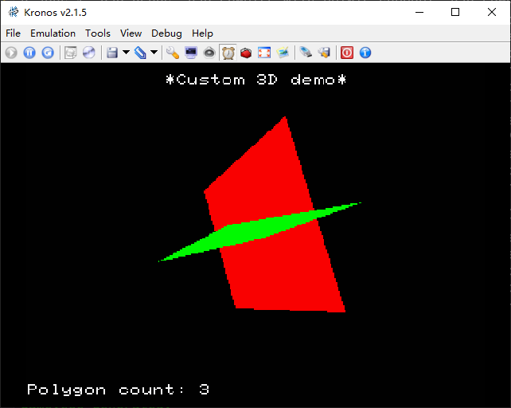

# SS_helloworld

A basic Sega Saturn(SS)  app

# config jo-engine
- Download and unzip https://github.com/johannes-fetz/joengine/archive/master.zip
- cd to `joengine/Samples`
- clone this repo, or use other samples in this dir

# Referencs
- https://github.com/johannes-fetz/joengine
- https://github.com/johannes-fetz/joengine/archive/master.zip
- https://www.jo-engine.org/home/
- https://www.jo-engine.org/tutorial/
- [SGL doc](https://www.jo-engine.org/upload/files/SEGA/ST-238-R1-051795.pdf)
